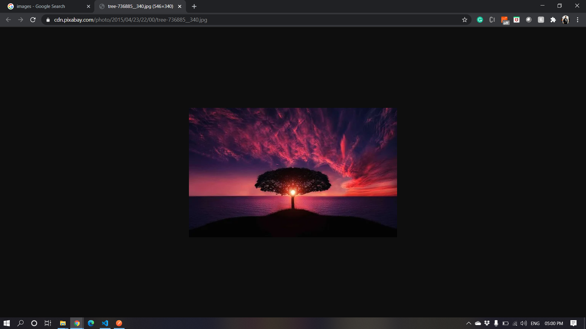

# Computer vision: Image Analyzing API

## Venkata Sai Koushik Koritala

## ID# 801135486

The Computer Vision service provides us with AI algorithms for processing images and returning information on their visual features.

**This API can be used for the following things:**

1. Celebrity Face Identification
2. Text Extraction
3. Brand Detection
4. Object Detection

For using the API for the things metioned above, We have four endpoints.

> **The Base URL for the API is,** <br/> http://167.99.225.207:3000/api/v1/

<br/>

> **The API working can be observed at,** <br/> [API Documentation Using Swagger](http://167.99.225.207:3000/api-docs/)

<br/>

**All the Endpoints in the API are `POST` requests that use the following request body which is in JSON format:**

```JavaScript
{
    "imageUrl" : "<< Your_Image_URL >>"
}
```

<br/>
<br/>


<br/>
<br/>

## **Using the API with `POSTMAN`**

---

## 1. Celebrity Face Identification

<br/>

### Endpoint: `/identifyCeleb`

- Send a `POST` request to the url - `http://167.99.225.207:3000/api/v1/identifyCeleb`<br/>
  by using a request body as mentioned above.
- You will get a JSON as an output with the details about the celebrity in the Image. If no celebrity is identified, then the description of the image will be given as output.
- In the place of `<< Your_Image_URL >>` you can use the following example URL:<br/>

  > https://pyxis.nymag.com/v1/imgs/4e5/1f7/a917c50e70a4c16bc35b9f0d8ce0352635-14-tom-cruise.rsquare.w700.jpg

  
  

  > https://raw.githubusercontent.com/Azure-Samples/cognitive-services-sample-data-files/master/ComputerVision/Images/celebrities.jpg

  
  

- If we pass a image URL which does not have a celebrity or if the API does not identify the celebrity then the output will be as following:

  > https://cdn.images.express.co.uk/img/dynamic/109/590x/world-smile-day-top-facts-about-smiling-863001.jpg

  
  

    <br/>
    <br/>

---

## 2. Text Extraction

<br/>

### Endpoint: `/readText`

- Send a `POST` request to the url - `http://167.99.225.207:3000/api/v1/readText`<br/>
  by using a request body as mentioned above.
- You will get a JSON as an output with the text that is identified in the Image. If no text is identified, then the message saying the same will be given as output.
- In the place of `<< Your_Image_URL >>` you can use the following example URL:<br/>

  > https://ocr-demo.abtosoftware.com/uploads/handwritten2.jpg

  
  

  > https://moderatorsampleimages.blob.core.windows.net/samples/sample2.jpg

  
  

- If we pass a image URL which does not have any text or if the API does not identify any text then the output will be as following:

  > https://cdn.pixabay.com/photo/2015/04/23/22/00/tree-736885__340.jpg

  
  

    <br/>
    <br/>

---

## 3. Brand Detection

<br/>

### Endpoint: `/detectBrand`

- Send a `POST` request to the url - `http://167.99.225.207:3000/api/v1/detectBrand`<br/>
  by using a request body as mentioned above.
- You will get a JSON as an output with the brand name that is identified in the Image. If no brand is identified, then the message saying the same will be given as output.
- In the place of `<< Your_Image_URL >>` you can use the following example URL:<br/>

  > https://www.swagshirts99.com/wp-content/uploads/2020/05/777fe3eb-8e63-49c2-979c-f12f0f1c7c48.jpg

  
  

  > https://static.nike.com/a/images/t_PDP_1280_v1/f_auto,q_auto:eco/zxgvvbflzw529uvanto4/air-zoom-structure-22-running-shoe-jR46t0.jpg

  
  

- If we pass a image URL which does not have any brands or if the API does not identify any brand then the output will be as following:

  > https://cdn.pixabay.com/photo/2015/04/23/22/00/tree-736885__340.jpg

  
  

    <br/>
    <br/>

---

## 4. Object Detection

<br/>

### Endpoint: `/detectObject`

- Send a `POST` request to the url - `http://167.99.225.207:3000/api/v1/detectObject`<br/>
  by using a request body as mentioned above.
- You will get a JSON as an output with the objects identified in the Image. If no object is identified, then the message saying the same will be given as output.
- In the place of `<< Your_Image_URL >>` you can use the following example URL:<br/>

  > https://www.exposit.com/media/images/Object_detection_for_traffic_analysis.original.original.png

  
  

  > https://st4.depositphotos.com/13349494/27426/i/600/depositphotos_274265420-stock-photo-single-opened-tube-red-lipstick.jpg

  
  

- If we pass a image URL which does not have any objects or if the API does not identify any object then the output will be as following:

  > https://images.creativemarket.com/0.1.0/ps/2974511/1500/1000/m1/fpnw/wm0/st-14-8%D0%B2-.jpg?1500099753&s=648ee09079ab13818f6f3190eec05fc8

  
  

    <br/>
    <br/>

---

## Bad Request:

What happens when we send a request body with the JSON which do not have the structure mentioned above?


> We get `Bad Request` as output.<br/>


<br/>

---

## The imageUrl containing anything which is not a URL:

> We will get `Entered value must be an URL` as response.<br/>


<br/>

---

## If the given imageUrl is a URL but not of an image:

> We will get `Invalid Image URL` as a response.<br/>


<br/>

---
